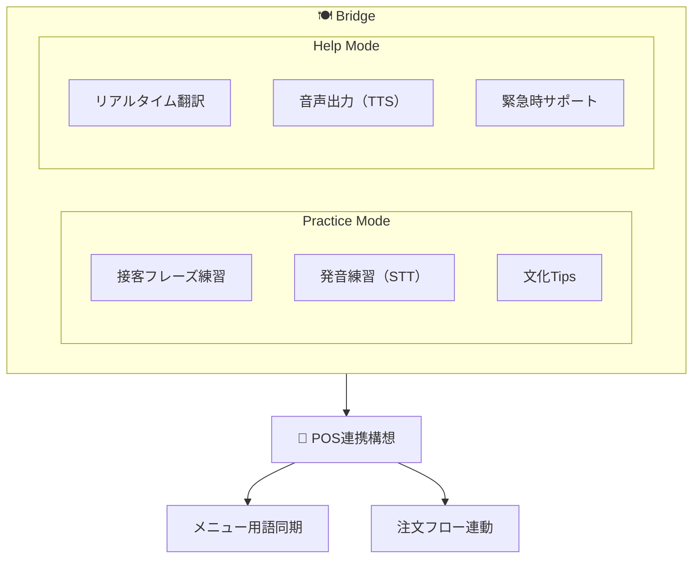
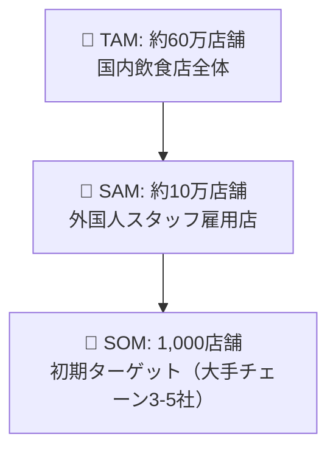
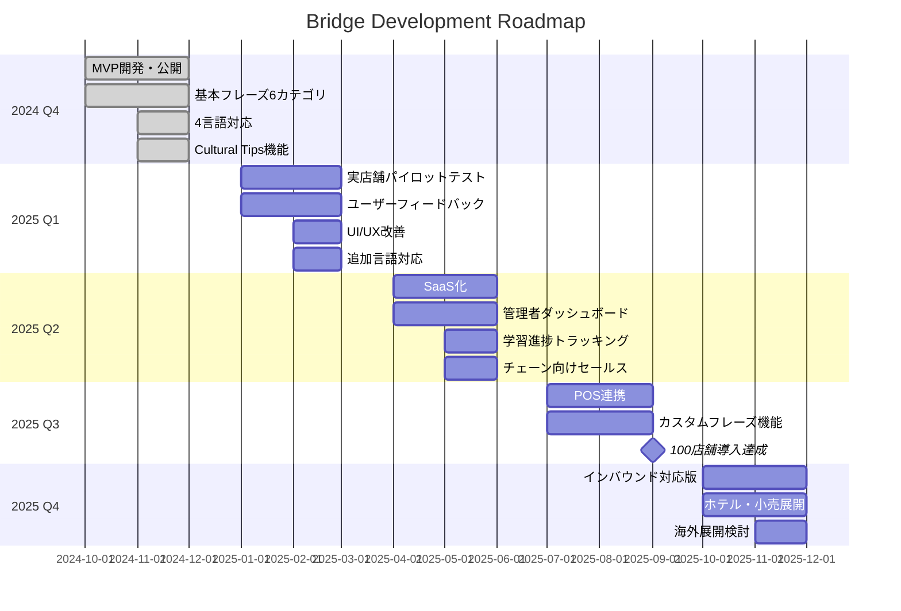
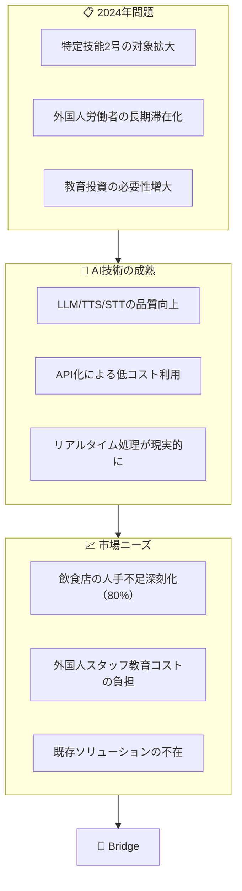

# Bridge - Restaurant Staff Japanese Training

**外国人飲食店スタッフ向け 日本語・接客トレーニングアプリ**

> Connecting restaurant staff with Japanese language and culture

**Live Demo:** https://bridge.three-sisters.ai/


---

## Pitch Deck

### 1. Vision / ビジョン

**「言葉の壁」を「架け橋」に変える**

日本の飲食業界で働く外国人スタッフが、日本語と日本の接客文化を素早く習得し、自信を持って働けるようにする。

---

### 2. Problem / 課題

#### 日本の飲食業界が直面する構造的問題

| 課題 | 数字 |
|------|------|
| 飲食業の人手不足率 | **80.0%**（2024年、帝国データバンク） |
| 外国人労働者数 | **200万人突破**（2023年、過去最高） |
| 飲食業の外国人比率 | 約**12%**（特定技能・技能実習含む） |

#### 現場で起きていること

```
店長「外国人スタッフを雇いたいが、教育コストが高い」

外国人スタッフ「日本語が難しい。お客様に何を言えばいいかわからない」

お客様「店員さんが何を言っているかわからない」
```

#### 既存の解決策の限界

| 方法 | 問題点 |
|------|--------|
| 日本語学校 | 高コスト・時間がかかる・接客特化でない |
| OJT（現場教育） | 店長の負担大・属人化・品質ばらつき |
| 翻訳アプリ（Google等） | 接客フレーズに最適化されていない・敬語対応弱い |
| Duolingo等 | 汎用的・飲食店接客に特化していない |

---

### 3. Solution / 解決策

#### Bridge - 飲食店接客に特化したAI語学トレーニング



#### 主要機能

| 機能 | 説明 |
|------|------|
| **Practice Mode** | 6カテゴリの接客フレーズを音声で練習 |
| **Help Mode** | 困った時にリアルタイム翻訳・代理発声 |
| **Cultural Tips** | カテゴリごとに日本文化のポイントを表示 |
| **多言語対応** | 英語・中国語・ベトナム語・ネパール語 |

#### 6カテゴリの接客フレーズ

1. **挨拶** - いらっしゃいませ、こちらへどうぞ
2. **注文** - ご注文はお決まりですか？、かしこまりました
3. **料理提供** - お待たせいたしました、ごゆっくりどうぞ
4. **会計** - お会計は○○円です、○○円のお返しです
5. **トラブル対応** - 申し訳ございません、店長を呼んでまいります
6. **お見送り** - ありがとうございました、またのお越しを

---

### 4. Target Market / ターゲット市場

#### Primary: 飲食店チェーン・多店舗展開企業

| セグメント | 店舗数 | 外国人スタッフ率 |
|------------|--------|------------------|
| ファミレス | 約10,000店 | 15-20% |
| 居酒屋チェーン | 約15,000店 | 20-30% |
| ファストフード | 約20,000店 | 25-35% |
| コンビニ（飲食含む） | 約56,000店 | 10-15% |

#### Secondary: 独立系飲食店

- インバウンド需要の高いエリア（東京・大阪・京都・福岡）
- 外国人観光客の多い観光地の飲食店

#### TAM/SAM/SOM



---

### 5. Business Model / 収益モデル

#### SaaS月額課金モデル

| プラン | 月額 | 内容 |
|--------|------|------|
| **Starter** | ¥5,000/店舗 | 基本フレーズ・3言語 |
| **Professional** | ¥10,000/店舗 | 全機能・5言語・カスタムフレーズ |
| **Enterprise** | 要相談 | POS連携・専用サポート・API |

#### 追加オプション

| オプション | 料金 |
|------------|------|
| 言語追加（1言語） | +¥2,000/月 |
| メニュー登録代行 | ¥50,000（初回） |
| カスタムフレーズ作成 | ¥30,000〜 |
| 管理者ダッシュボード | +¥5,000/月 |

#### 収益シミュレーション

| Year | 店舗数 | 月額単価 | 年間売上 |
|:----:|-------:|--------:|---------:|
| 1 | 100店舗 | ¥8,000 | **¥9,600,000** |
| 2 | 500店舗 | ¥8,000 | **¥48,000,000** |
| 3 | 2,000店舗 | ¥8,000 | **¥192,000,000** |

---

### 6. Competitive Advantage / 競合優位性

| 項目 | Bridge | Duolingo | Google翻訳 | ポケトーク |
|------|:------:|:--------:|:----------:|:----------:|
| 飲食店接客特化 | ◎ | × | × | × |
| 敬語（keigo）対応 | ◎ | △ | △ | △ |
| 文化Tips | ◎ | × | × | × |
| 発音練習 | ◎ | ○ | × | × |
| リアルタイム翻訳 | ◎ | × | ◎ | ◎ |
| POS連携（構想） | ◎ | × | × | × |
| 導入コスト | 低 | 低 | 無料 | 中（端末購入） |

#### 技術的優位性

- **ElevenLabs TTS**: 自然な日本語発音
- **OpenAI Whisper STT**: 高精度な音声認識
- **LLM翻訳**: 敬語・接客用語に最適化
- **POS連携構想**: 既存POS基盤との統合

---

### 7. Roadmap / ロードマップ



---

### 8. Team / チーム

#### 開発者

**越川 将人 / Masato Koshikawa**

- Python 8年 / AI・LLM開発 1年
- 4つのAIプロダクトを個人で設計・実装・運用
- RAG/マルチエージェント/音声AI実装経験
- 「悔しさをプロダクトに変える」開発姿勢

#### ポートフォリオ

| プロダクト | URL |
|------------|-----|
| AI VTuber (LINE Bot) | [GitHub](https://github.com/koshikawa-masato/AI-Vtuber-Project) |
| Sisters-On-WhatsApp | [GitHub](https://github.com/koshikawa-masato/Sisters-On-WhatsApp) |
| Sisters-Multilingual-Coach | https://coach.three-sisters.ai/ |
| Kuroko Interview | https://kuroko.three-sisters.ai/ |

#### 求めているリソース

| リソース | 目的 |
|----------|------|
| 飲食店パートナー | パイロットテスト実施 |
| 営業・BD担当 | チェーン展開のセールス |
| 資金調達（シード） | 開発加速・マーケティング |

---

### 9. Why Now? / なぜ今か



---

### 10. Contact / お問い合わせ

**Bridge - Restaurant Staff Japanese Training**

- **Demo:** https://bridge.three-sisters.ai/
- **Developer:** Masato Koshikawa
- **GitHub:** [koshikawa-masato](https://github.com/koshikawa-masato)

---

## Technical Stack

| Component | Technology |
|-----------|------------|
| Frontend | Streamlit |
| TTS | ElevenLabs API |
| STT | OpenAI Whisper |
| LLM | Kimi API |
| Hosting | XServer VPS |
| SSL | Cloudflare |

## Local Development

```bash
# Clone
git clone https://github.com/koshikawa-masato/Bridge-Restaurant-Training.git
cd Bridge-Restaurant-Training

# Setup
python -m venv venv
source venv/bin/activate
pip install -r requirements.txt

# Configure
cp .env.example .env
# Edit .env with your API keys

# Run
streamlit run src/app.py
```

## License

MIT License

---

*Built with passion to bridge the gap between cultures.*
