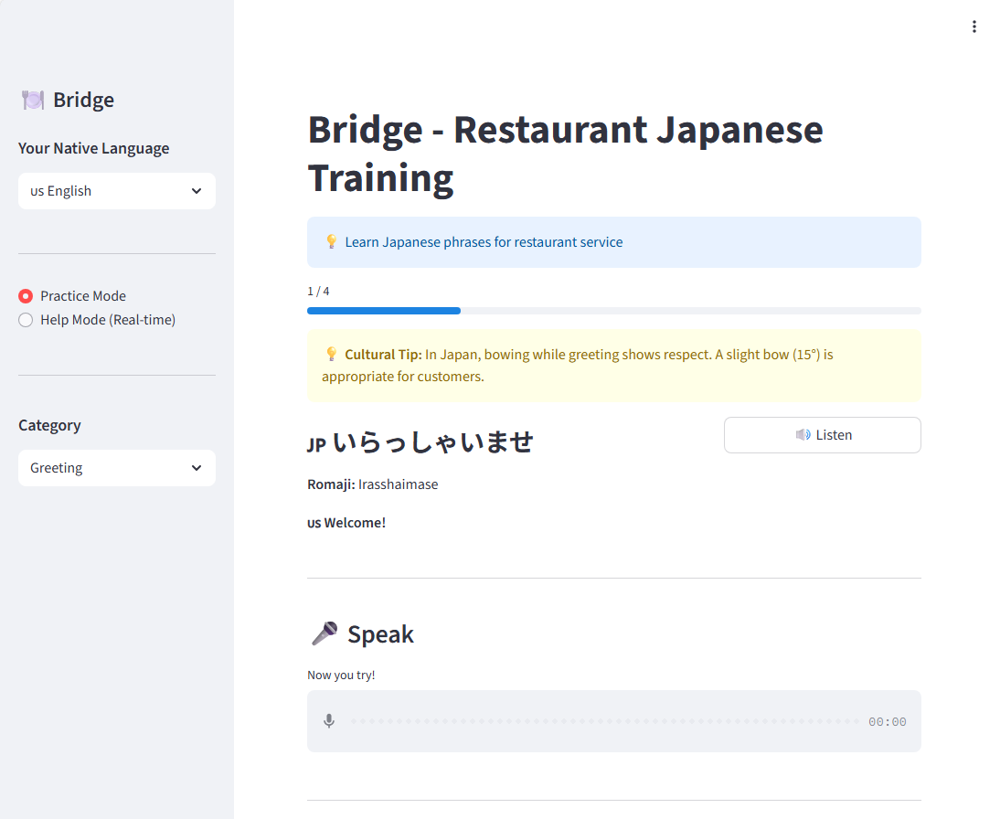
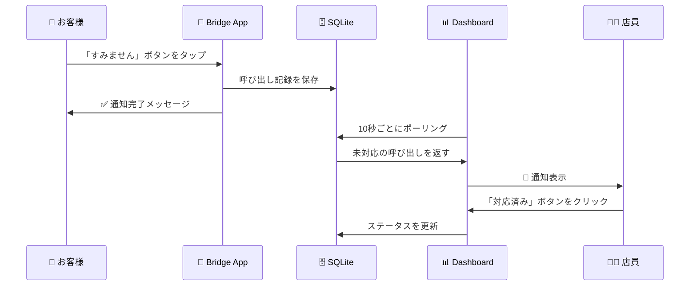
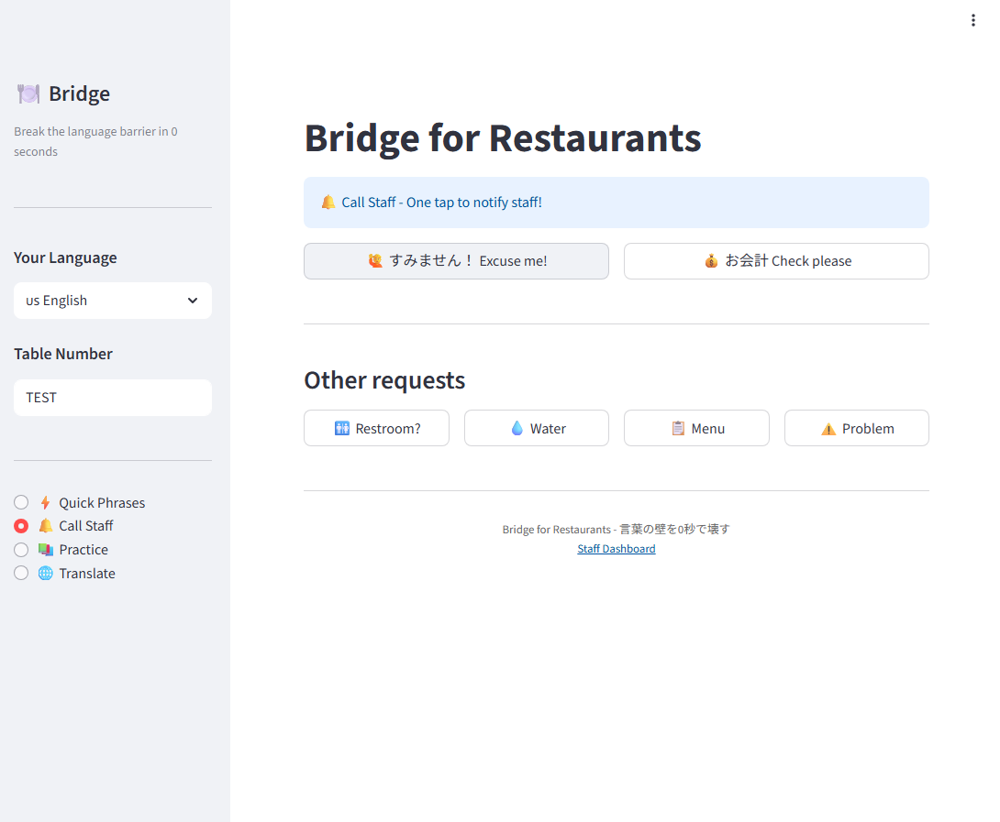
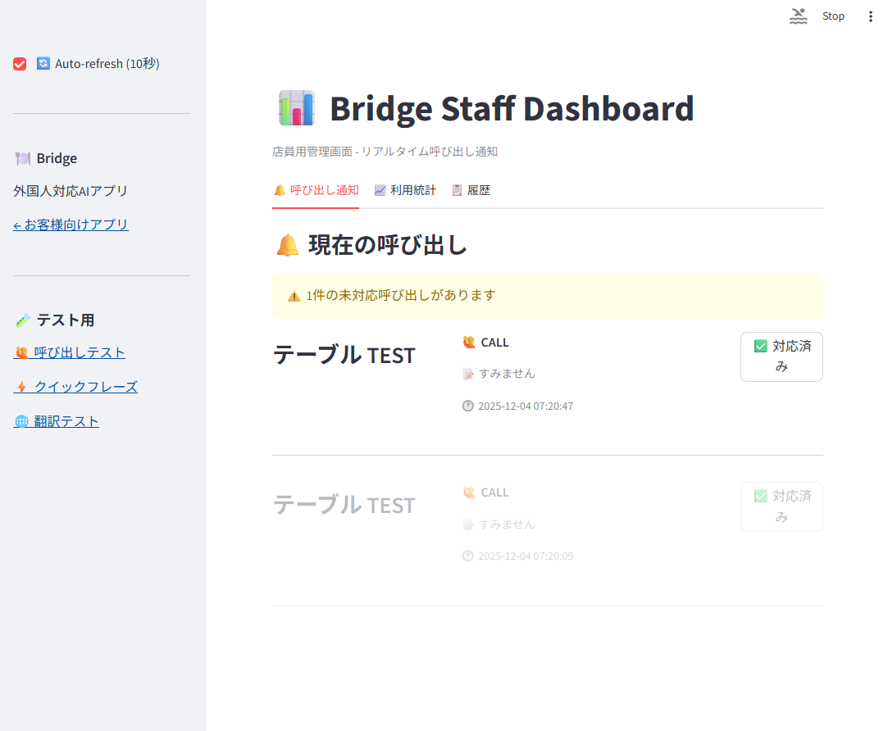
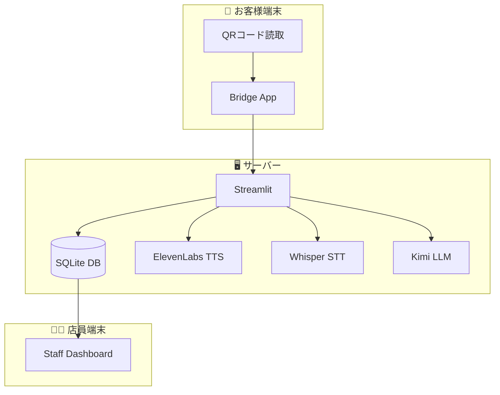
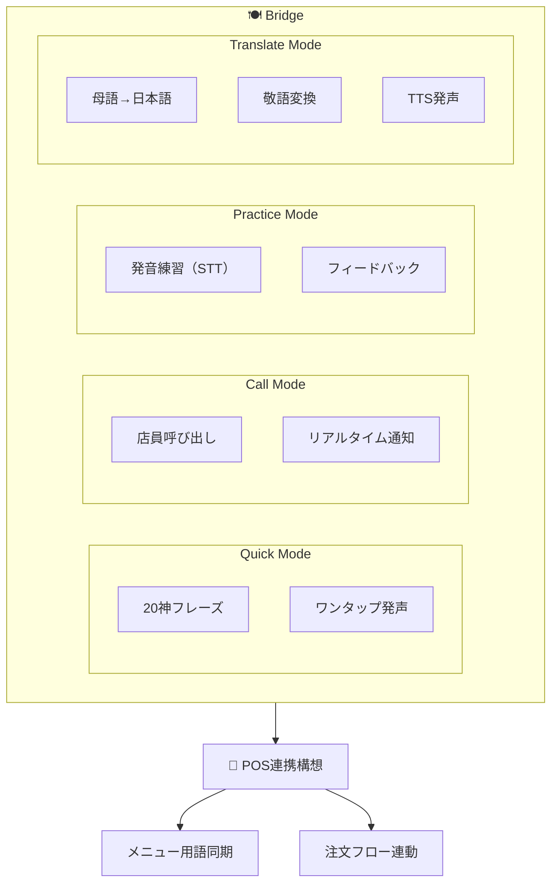
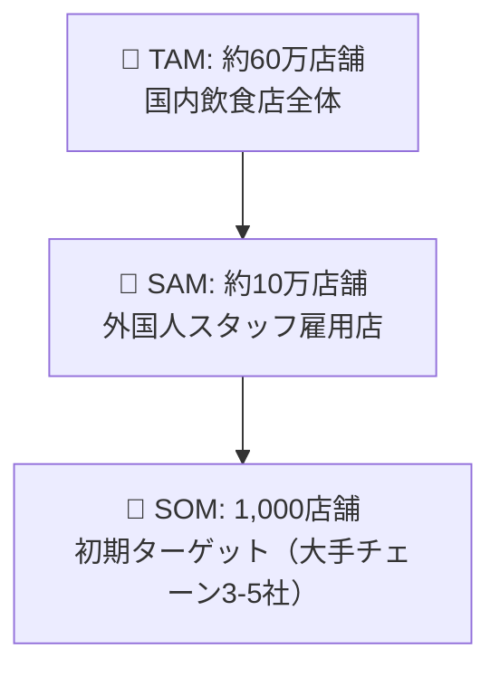
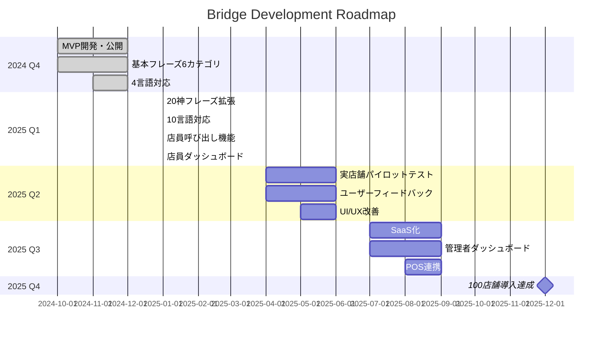
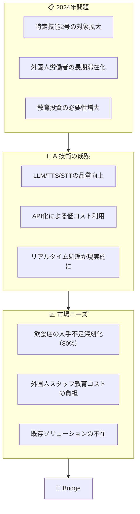

# Bridge - Restaurant Staff Japanese Training

**外国人飲食店スタッフ向け 日本語・接客トレーニングアプリ**

> 言葉の壁を0秒で壊す、飲食店の新常識

**Live Demo:** https://bridge.three-sisters.ai/



---

## 新コンセプト

### タグライン
> **「言葉の壁を0秒で壊す」**

### ポジショニング
「Bridge」は単なる翻訳アプリではなく、飲食店専用の「通訳＋秘書」。
- 翻訳アプリ → 調べる（数秒〜数十秒）
- Bridge → 画面を見せる or 音声再生（0秒）

---

## 機能一覧

### 1. Quick Phrases Mode（神フレーズ20選）

タップ1回で日本語フレーズを発声。外国人スタッフが最も困る場面を厳選。

| カテゴリ | フレーズ例 |
|----------|------------|
| 呼び出し | すみません！ |
| 会計 | お会計お願いします / カードは使えますか？ |
| 注文 | おすすめは何ですか？ / これをください |
| 質問 | トイレはどこですか？ |
| アレルギー | アレルギーがあります / 辛くしないでください |
| 挨拶 | いらっしゃいませ / ありがとうございました |
| 接客 | 少々お待ちください / お待たせいたしました |

### 2. Call Staff Mode（店員呼び出し）

ワンタップで店員を呼び出し。SQLiteでリアルタイム通知。

#### 動作フロー



#### Step 1: お客様が「すみません」ボタンをタップ



#### Step 2: 店員ダッシュボードに通知が表示



### 3. Practice Mode（発音練習）

音声認識で発音をチェック。正しく言えたかフィードバック。

### 4. Translate Mode（リアルタイム翻訳）

母語で入力 → 敬語日本語に変換 → TTS発声

---

## 対応言語（10言語）

| 言語 | フラグ | Accept-Language |
|------|--------|-----------------|
| English | 🇺🇸 | en, en-US, en-GB |
| 中文 | 🇨🇳 | zh, zh-CN, zh-TW |
| Tiếng Việt | 🇻🇳 | vi, vi-VN |
| नेपाली | 🇳🇵 | ne, ne-NP |
| 한국어 | 🇰🇷 | ko, ko-KR |
| Tagalog | 🇵🇭 | tl, fil, fil-PH |
| Bahasa | 🇮🇩 | id, id-ID |
| ไทย | 🇹🇭 | th, th-TH |
| Português | 🇧🇷 | pt, pt-BR, pt-PT |
| Español | 🇪🇸 | es, es-ES, es-MX |

**自動言語判定**: ブラウザのAccept-Languageから母語を自動検出

---

## システム構成



---

## URL設計

| 用途 | URL | 説明 |
|------|-----|------|
| 基本 | `/?lang=en&table=5` | 言語とテーブル指定 |
| QR用 | `/?table=5` | テーブルのみ（言語自動判定） |
| モード指定 | `/?mode=quick` | quick/call/practice/translate |
| ダッシュボード | Port 8504 | 店員用管理画面 |

---

## Pitch Deck

### 1. Vision / ビジョン

**「言葉の壁」を「架け橋」に変える**

日本の飲食業界で働く外国人スタッフが、日本語と日本の接客文化を素早く習得し、自信を持って働けるようにする。

---

### 2. Problem / 課題

#### 日本の飲食業界が直面する構造的問題

| 課題 | 数字 |
|------|------|
| 飲食業の人手不足率 | **80.0%**（2024年、帝国データバンク） |
| 外国人労働者数 | **200万人突破**（2023年、過去最高） |
| 飲食業の外国人比率 | 約**12%**（特定技能・技能実習含む） |

#### 現場で起きていること

```
店長「外国人スタッフを雇いたいが、教育コストが高い」

外国人スタッフ「日本語が難しい。お客様に何を言えばいいかわからない」

お客様「店員さんが何を言っているかわからない」
```

---

### 3. Solution / 解決策

#### Bridge - 飲食店接客に特化したAI語学トレーニング



---

### 4. Target Market / ターゲット市場

#### TAM/SAM/SOM



---

### 5. Business Model / 収益モデル

#### SaaS月額課金モデル

| プラン | 月額 | 内容 |
|--------|------|------|
| **Starter** | ¥5,000/店舗 | 基本フレーズ・5言語 |
| **Professional** | ¥10,000/店舗 | 全機能・10言語・カスタムフレーズ |
| **Enterprise** | 要相談 | POS連携・専用サポート・API |

---

### 6. Competitive Advantage / 競合優位性

| 項目 | Bridge | Duolingo | Google翻訳 | ポケトーク |
|------|:------:|:--------:|:----------:|:----------:|
| 飲食店接客特化 | ◎ | × | × | × |
| 敬語（keigo）対応 | ◎ | △ | △ | △ |
| 店員呼び出し | ◎ | × | × | × |
| 発音練習 | ◎ | ○ | × | × |
| リアルタイム翻訳 | ◎ | × | ◎ | ◎ |
| POS連携（構想） | ◎ | × | × | × |

---

### 7. Roadmap / ロードマップ



---

### 8. Why Now? / なぜ今か



---

## Technical Stack

| Component | Technology |
|-----------|------------|
| Frontend | Streamlit |
| TTS | ElevenLabs API |
| STT | OpenAI Whisper |
| LLM | Kimi API |
| Database | SQLite |
| Hosting | XServer VPS |
| SSL | Cloudflare |

---

## Local Development

```bash
# Clone
git clone https://github.com/koshikawa-masato/Bridge-Restaurant-Training.git
cd Bridge-Restaurant-Training

# Setup
python -m venv venv
source venv/bin/activate
pip install -r requirements.txt

# Configure
cp .env.example .env
# Edit .env with your API keys

# Run main app
streamlit run src/app.py

# Run staff dashboard (別ターミナル)
streamlit run src/dashboard.py --server.port 8504
```

---

## Contact

**Bridge - Restaurant Staff Japanese Training**

- **Demo:** https://bridge.three-sisters.ai/
- **Developer:** Masato Koshikawa
- **GitHub:** [koshikawa-masato](https://github.com/koshikawa-masato)

---

## License

MIT License

---

*Built with passion to bridge the gap between cultures.*
*言葉の壁を0秒で壊す。*
